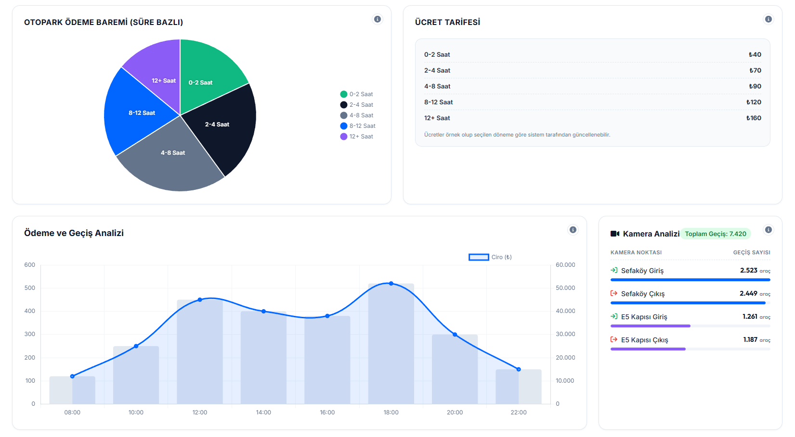

# Parking Dashboard (Türkçe)


---

## Genel Bakış

Bu repo iki ayrı kullanım için düzenlendi:

- **html-css-js/**: Düz HTML + CSS + JS (bağımsız kullanım)
- **laravel-filament/**: Laravel + Filament 4 için Blade ve asset kopyaları

---

## Klasör Yapısı

```
README.md
html-css-js/
  index.html
  style.css
  script.js

laravel-filament/
  dashboard.blade.php
  dashboard.css
  dashboard.js

screenshots/
  ss-full-view.png
  ss-filter-bar.png
  ss-cards-herocard.png
  ss-paymentmethod-density.png
  ss-parkpricing-cameras.png
  ss-mobile-view1.png
  ss-mobile-view2.png
  ss-mobile-view3.png
```

---

## HTML + CSS + JS (Bağımsız)

1) `html-css-js/` klasöründeki dosyaları kullanın.
2) `html-css-js/index.html` dosyasını tarayıcıda açın.

---

## Laravel + Filament 4 Kurulumu

Bu versiyon Filament 4 sayfasında doğru şekilde çalışması için ayrı dosyalarla geldi.

### 1) Dosyaları kopyala

- `laravel-filament/dashboard.blade.php` -> `resources/views/filament/pages/dashboard.blade.php`
- `laravel-filament/dashboard.css` -> `public/parking-dashboard/dashboard.css`
- `laravel-filament/dashboard.js` -> `public/parking-dashboard/dashboard.js`

### 2) Filament Page sınıfı

```php
<?php

namespace App\Filament\Pages;

use Filament\Pages\Page;

class Dashboard extends Page
{
    protected static ?string $navigationIcon = 'heroicon-o-chart-bar';
    protected static string $view = 'filament.pages.dashboard';
}
```

### 3) Blade içindeki asset linkleri

`dashboard.blade.php` içinde hazır:

```blade
@push('styles')
    <link rel="stylesheet" href="{{ asset('parking-dashboard/dashboard.css') }}">
@endpush

@push('scripts')
    <script src="https://cdn.jsdelivr.net/npm/chart.js"></script>
    <script src="{{ asset('parking-dashboard/dashboard.js') }}"></script>
@endpush
```

---

## Mobil Uyum

- Mobilde filtre bar **collapsed** açılır-kapanır yapıda.
- Kartlar ve grafikler **tam genişlik** kullanır.
- Tablolarda yatay kaydırma desteklenir.

### Mobil Görünümler

<table>
  <tr>
    <td align="center">
      
      <br/>
      <sub>Mobil filtre bar ve kartlar.</sub>
    </td>
    <td align="center">
      
      <br/>
      <sub>Mobil tablo ve grafik yoğunluğu.</sub>
    </td>
    <td align="center">
      
      <br/>
      <sub>Mobil pasta grafik ve detay alanları.</sub>
    </td>
  </tr>
</table>

---

## Görseller

<table>
  <tr>
    <td align="center">
      
      <br/>
      <sub>Sticky ve mobilde açılır filtre bar.</sub>
    </td>
    <td align="center">
      
      <br/>
      <sub>Cost KPI kartları ve hero ciro bölümü.</sub>
    </td>
  </tr>
  <tr>
    <td align="center">
      
      <br/>
      <sub>Ödeme yöntemleri tablosu ve saatlik yoğunluk.</sub>
    </td>
    <td align="center">
      
      <br/>
      <sub>Ücret tarifesi ve kamera analizi.</sub>
    </td>
  </tr>
</table>

---

## Notlar

- `laravel-filament/dashboard.css` Filament için izole edildi; resetler ve değişkenler yalnızca `.parking-dashboard` içinde geçerli.
- Blade dosyası içerikleri `.parking-dashboard` wrapper'ı ile sarılmıştır.